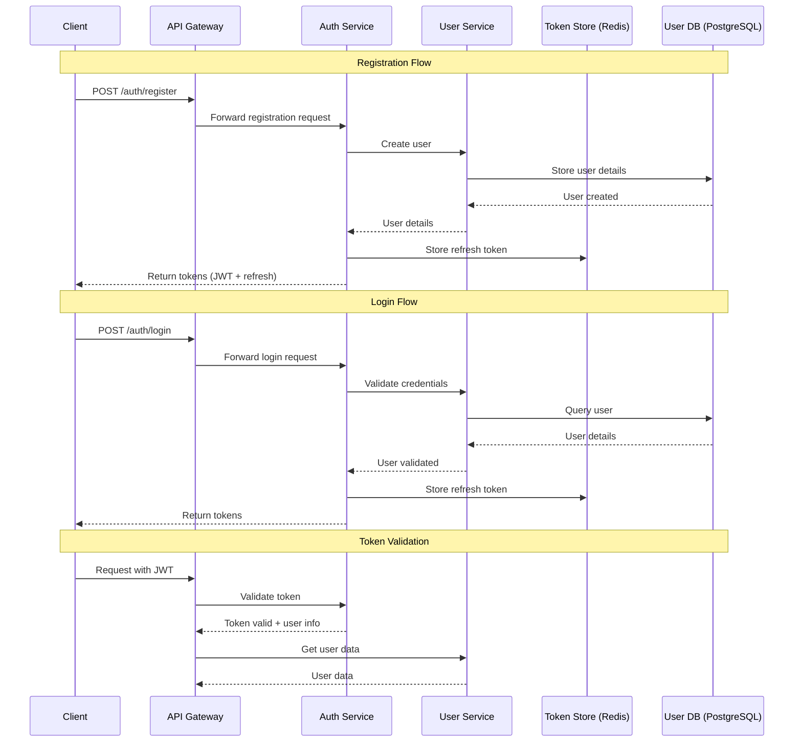

```mermaid
sequenceDiagram
    participant C as Client
    participant AG as API Gateway
    participant Auth as Auth Service
    participant US as User Service
    participant Redis as Token Store (Redis)
    participant DB as User DB (PostgreSQL)

    %% Registration Flow
    Note over C,DB: Registration Flow
    C->>AG: POST /auth/register
    AG->>Auth: Forward registration request
    Auth->>US: Create user
    US->>DB: Store user details
    DB-->>US: User created
    US-->>Auth: User details
    Auth->>Redis: Store refresh token
    Auth-->>C: Return tokens (JWT + refresh)

    %% Login Flow
    Note over C,DB: Login Flow
    C->>AG: POST /auth/login
    AG->>Auth: Forward login request
    Auth->>US: Validate credentials
    US->>DB: Query user
    DB-->>US: User details
    US-->>Auth: User validated
    Auth->>Redis: Store refresh token
    Auth-->>C: Return tokens

    %% Token Validation
    Note over C,DB: Token Validation
    C->>AG: Request with JWT
    AG->>Auth: Validate token
    Auth-->>AG: Token valid + user info
    AG->>US: Get user data
    US-->>AG: User data
```