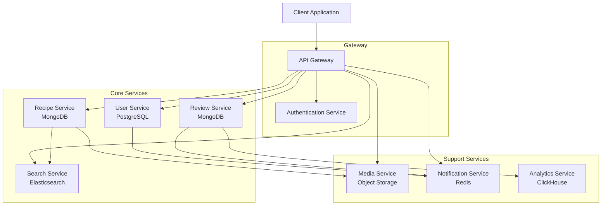

```mermaid
graph TD
    C[Client Application]
    
    subgraph Gateway
        AG[API Gateway]
        Auth[Authentication Service]
    end
    
    subgraph Core Services
        RS[Recipe Service<br/>MongoDB]
        US[User Service<br/>PostgreSQL]
        SS[Search Service<br/>Elasticsearch]
        RVS[Review Service<br/>MongoDB]
    end
    
    subgraph Support Services
        MS[Media Service<br/>Object Storage]
        NS[Notification Service<br/>Redis]
        AS[Analytics Service<br/>ClickHouse]
    end

    C --> AG
    AG --> Auth
    AG --> RS
    AG --> US
    AG --> SS
    AG --> RVS
    AG --> MS
    AG --> NS
    
    RS --> MS
    RS --> SS
    US --> NS
    RVS --> NS
    RVS --> AS
```